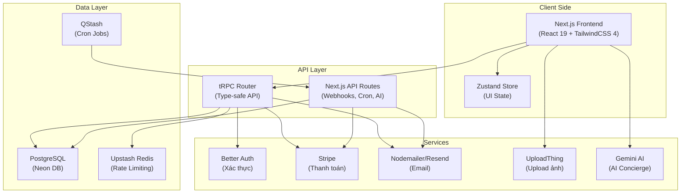
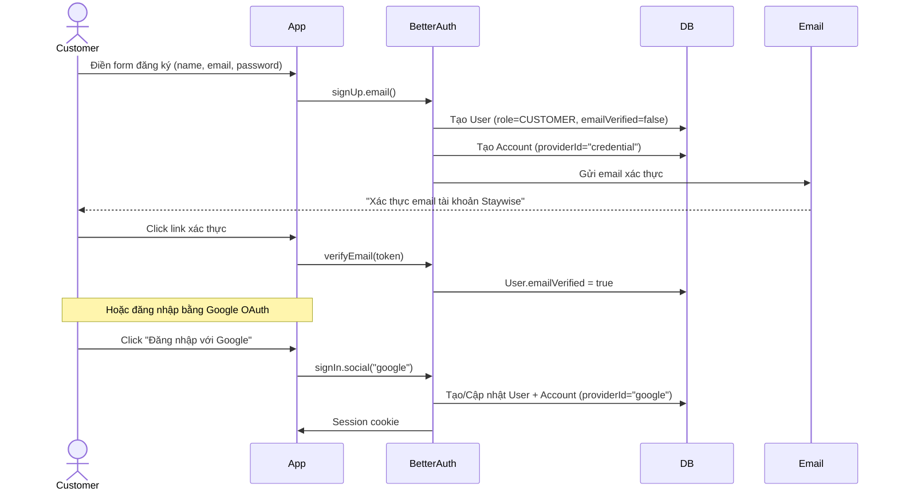
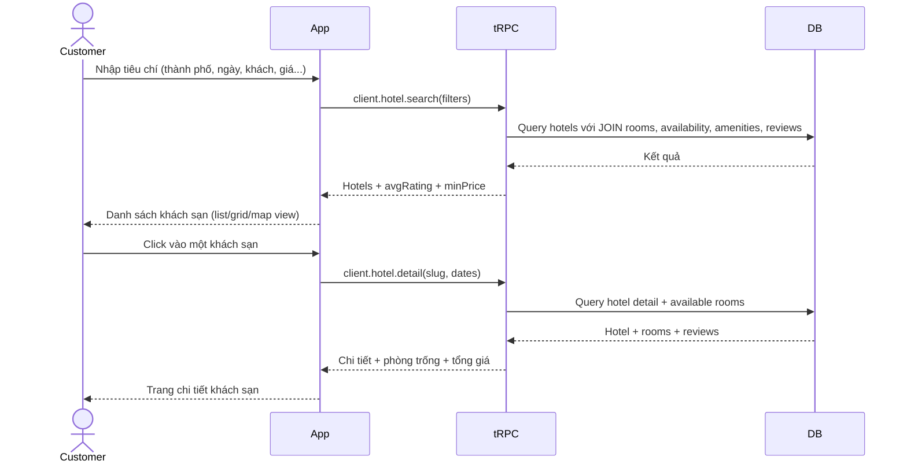
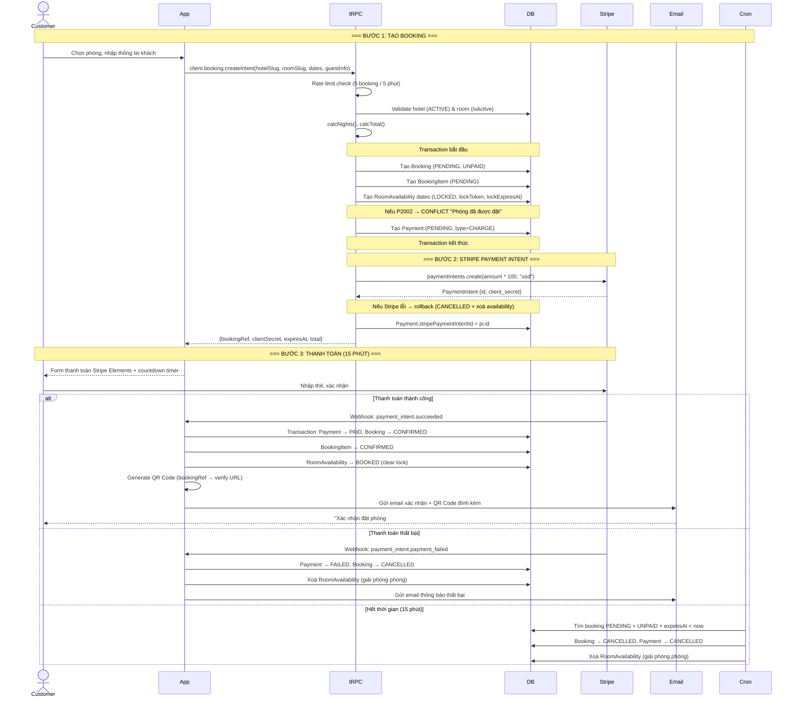
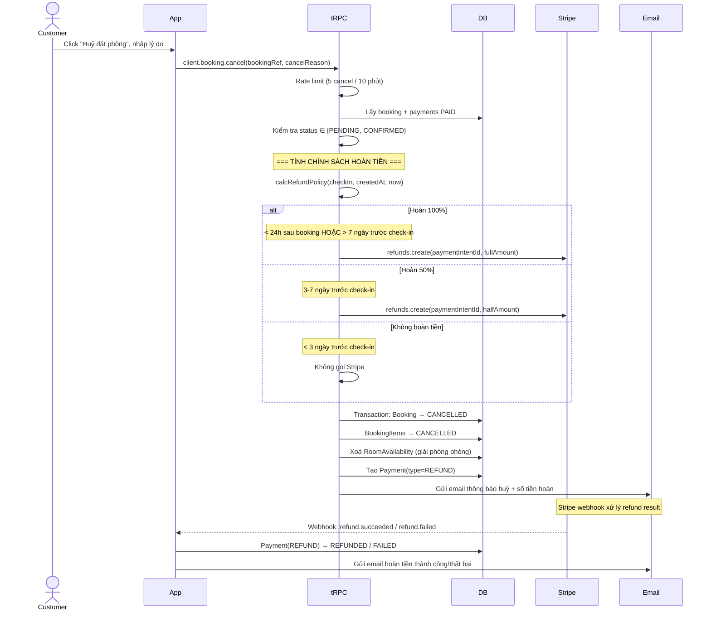
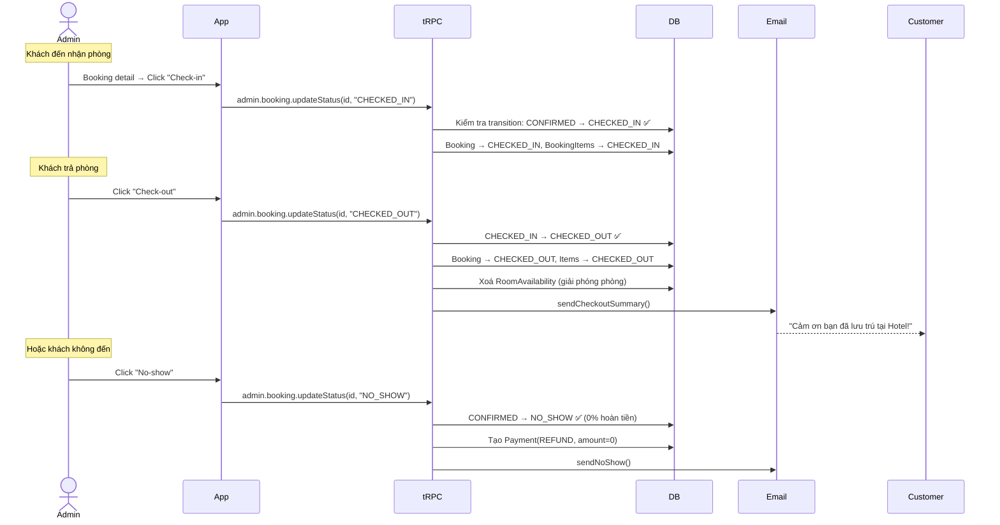
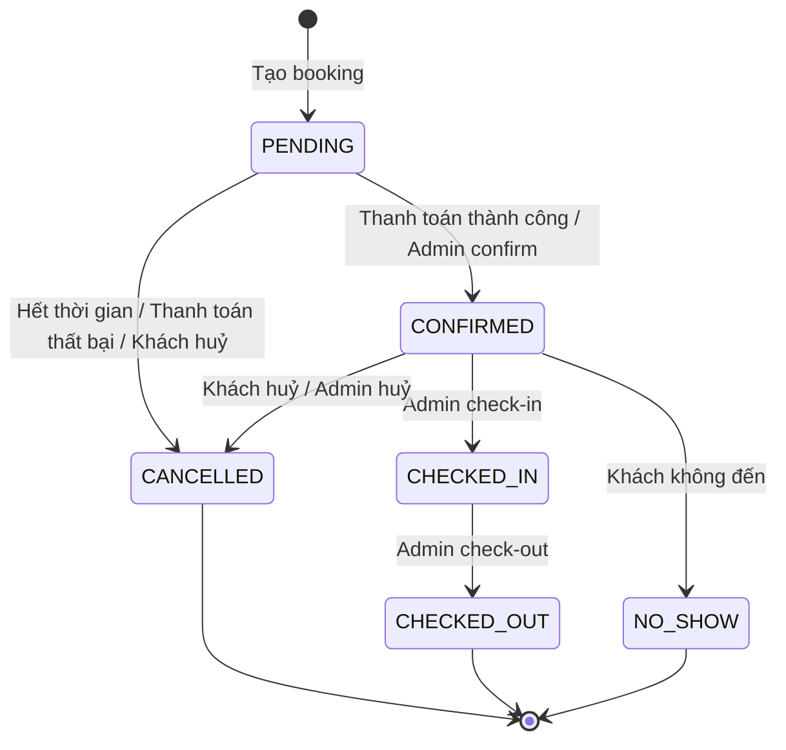
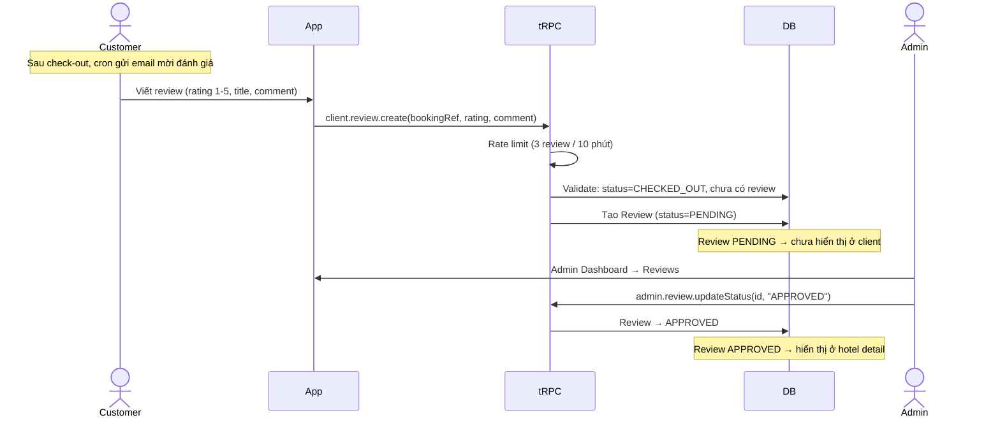
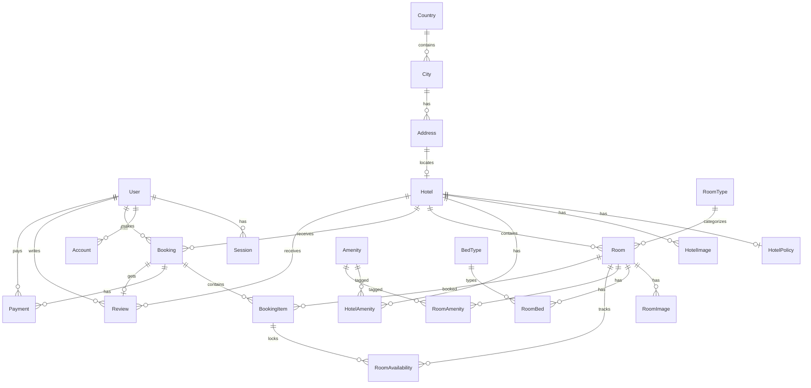
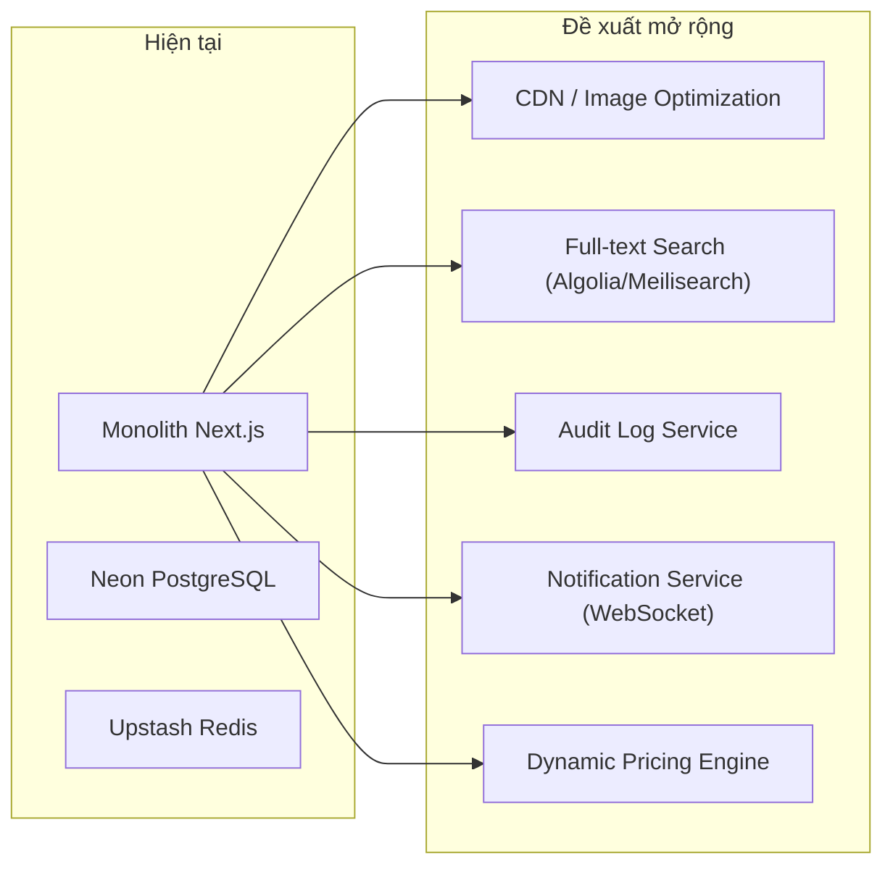

# 🏨 Phân Tích Luồng Nghiệp Vụ — Staywise Hotel Booking Platform

> **Dự án:** Staywise — Nền tảng đặt phòng khách sạn trực tuyến
> **Tech Stack:** Next.js 16 · TypeScript · Prisma (PostgreSQL/Neon) · tRPC · Stripe · Upstash (Redis + QStash) · Better Auth · Gemini AI
> **Ngày phân tích:** 11/04/2026

---

## 📌 Mục Lục

1. [Tổng Quan Hệ Thống](#1-tổng-quan-hệ-thống)
2. [Actors & Roles](#2-actors--roles)
3. [Luồng End-to-End](#3-luồng-end-to-end)
4. [Phân Tích Tính Năng Chi Tiết](#4-phân-tích-tính-năng-chi-tiết)
5. [Thiết Kế CSDL & Quan Hệ](#5-thiết-kế-csdl--quan-hệ)
6. [API & Data Flow](#6-api--data-flow)
7. [Business Logic Cốt Lõi](#7-business-logic-cốt-lõi)
8. [Edge Cases & Exceptions](#8-edge-cases--exceptions)
9. [Đánh Giá Rủi Ro & Đề Xuất](#9-đánh-giá-rủi-ro--đề-xuất)

---

## 1. Tổng Quan Hệ Thống

### Bài toán giải quyết

Staywise là một **nền tảng B2C (Business-to-Consumer) đặt phòng khách sạn**, cho phép khách hàng tìm kiếm, so sánh, và đặt phòng khách sạn trực tuyến với thanh toán qua Stripe.

### Mô hình kinh doanh

```
Khách hàng ──→ Tìm phòng ──→ Đặt phòng ──→ Thanh toán (Stripe) ──→ Xác nhận ──→ Check-in ──→ Check-out ──→ Đánh giá
                                │                                        │
                                └── Hết thời gian ──→ Tự động huỷ       └── QR Code + Email xác nhận
```

### Kiến trúc tổng thể



### Công nghệ nổi bật

| Thành phần | Công nghệ | Mục đích |
|---|---|---|
| **Framework** | Next.js 16 (App Router) | Full-stack React framework |
| **API** | tRPC v11 + TanStack Query | Type-safe API, auto-caching |
| **Database** | Prisma 7 + PostgreSQL (Neon) | ORM & serverless PostgreSQL |
| **Auth** | Better Auth | Xác thực email/password + Google OAuth |
| **Payment** | Stripe (PaymentIntent) | Thanh toán thẻ quốc tế |
| **Email** | Nodemailer + React Email | Email template đẹp, đa dạng |
| **Queue** | Upstash QStash | Cron jobs serverless |
| **Rate Limit** | Upstash Redis + Ratelimit | Chống spam/DDoS |
| **AI** | Google Gemini | AI Concierge hỗ trợ khách hàng |
| **Upload** | UploadThing | Upload ảnh hotel/room |
| **UI** | Radix UI + shadcn/ui | Component library |
| **Animation** | Framer Motion | Hiệu ứng UI mượt mà |
| **Map** | Leaflet + React Leaflet | Bản đồ vị trí khách sạn |
| **Charts** | Recharts | Dashboard biểu đồ admin |

---

## 2. Actors & Roles

### 2.1 CUSTOMER (Khách hàng)

Người dùng chính của nền tảng, thực hiện các thao tác:

| Chức năng | Mô tả |
|---|---|
| **Đăng ký / Đăng nhập** | Email + mật khẩu hoặc Google OAuth |
| **Tìm kiếm khách sạn** | Bộ lọc: thành phố, ngày, giá, sao, tiện nghi, loại phòng |
| **Xem chi tiết khách sạn** | Ảnh, mô tả, tiện nghi, phòng trống, đánh giá |
| **Đặt phòng** | Chọn phòng → Nhập thông tin → Thanh toán Stripe |
| **Quản lý đặt phòng** | Xem danh sách, chi tiết, huỷ đặt phòng |
| **Viết đánh giá** | Chỉ sau check-out, 1 review/booking, rating 1-5 |
| **Quản lý tài khoản** | Cập nhật profile, xem booking history, xoá tài khoản |
| **Chat AI** | Hỏi đáp tự động về đặt phòng, chính sách hoàn tiền |

### 2.2 ADMIN (Quản trị viên)

Quản lý toàn bộ hệ thống thông qua Admin Dashboard:

| Chức năng | Mô tả |
|---|---|
| **Dashboard** | Thống kê doanh thu, booking, biểu đồ, top hotels |
| **Quản lý khách sạn** | CRUD hotels, ảnh, tiện nghi, chính sách |
| **Quản lý phòng** | CRUD rooms, giường, tiện nghi, availability |
| **Quản lý đặt phòng** | Chuyển trạng thái: CONFIRMED → CHECK_IN → CHECK_OUT / NO_SHOW |
| **Quản lý đánh giá** | Duyệt (APPROVED) hoặc từ chối (REJECTED) reviews |
| **Quản lý người dùng** | Xem danh sách, thay đổi role |
| **Quản lý dữ liệu nền** | CRUD: Country, City, Amenity, RoomType, BedType |

### 2.3 SYSTEM (Hệ thống tự động)

Các tác vụ tự động chạy ngầm:

| Tác vụ | Lịch | Mô tả |
|---|---|---|
| **Expire Bookings** | Mỗi 5 phút | Tự huỷ booking PENDING quá 15 phút chưa thanh toán |
| **Check-in Reminder** | 8:00 sáng mỗi ngày | Gửi email nhắc khách check-in ngày mai |
| **Review Request** | 10:00 sáng mỗi ngày | Gửi email mời đánh giá cho khách vừa check-out hôm qua |
| **Stripe Webhooks** | Realtime | Xử lý payment succeeded/failed, refund succeeded/failed |

---

## 3. Luồng End-to-End

### 3.1 🔐 Luồng Đăng Ký & Xác Thực



> [!IMPORTANT]
> Hệ thống **bắt buộc xác thực email** trước khi cho phép sử dụng đầy đủ (`requireEmailVerification: true`).

### 3.2 🔍 Luồng Tìm Kiếm & Xem Chi Tiết Khách Sạn



**Bộ lọc tìm kiếm hỗ trợ:**
- 🔤 **Text search**: Theo tên thành phố hoặc quốc gia (case-insensitive)
- 📅 **Ngày check-in/check-out**: Kiểm tra `RoomAvailability` — chỉ hiện phòng AVAILABLE
- 👥 **Số khách**: `adults + children ≤ room.capacity`
- 💰 **Khoảng giá**: `minPrice ≤ basePrice ≤ maxPrice`
- ⭐ **Số sao**: Lọc `starRating`
- 🏷️ **Tiện nghi**: Lọc theo amenities
- 🛏️ **Loại giường**: Lọc `bedTypes`
- 🏠 **Loại phòng**: Lọc `roomTypes`
- 📊 **Rating tối thiểu**: Tính trung bình từ reviews APPROVED
- ↕️ **Sắp xếp**: `price_asc`, `price_desc`, `rating`, `stars`
- 🗺️ **View mode**: `list`, `grid`, `map`

### 3.3 💳 Luồng Đặt Phòng & Thanh Toán (CORE FLOW)

Đây là luồng **quan trọng nhất** của hệ thống, bao gồm nhiều bước phức tạp:



> [!CAUTION]
> **Cơ chế lock phòng 15 phút** là critical path:
> - Phòng được **LOCKED** ngay khi tạo booking (chưa thanh toán)
> - `lockToken` = bookingId, `lockExpiresAt` = now + 15 phút
> - Nếu có booking khác cùng phòng cùng ngày → `P2002 Unique Constraint` → trả lỗi CONFLICT
> - Cron job chạy mỗi **5 phút** để dọn booking hết hạn

### 3.4 ❌ Luồng Huỷ Đặt Phòng & Hoàn Tiền



### 3.5 🏨 Luồng Check-in / Check-out (Admin)



**State machine cho Booking Status:**



### 3.6 ⭐ Luồng Đánh Giá (Review)



> [!NOTE]
> - Mỗi booking chỉ có **đúng 1 review** (`bookingId` là `@unique` trong model Review)
> - Review phải được admin **duyệt** trước khi hiển thị
> - Rating trung bình khách sạn chỉ tính từ reviews **APPROVED**

---

## 4. Phân Tích Tính Năng Chi Tiết

### 4.1 Trang chủ (Homepage)

| API | Dữ liệu | Mô tả |
|---|---|---|
| `client.hotel.featured` | 6 hotels mới nhất (ACTIVE) | Khách sạn nổi bật |
| `client.hotel.popularDestinations` | Cities có nhiều hotel nhất | Điểm đến phổ biến |
| `client.hotel.topAmenities` | Amenities phổ biến nhất | Tiện nghi hàng đầu |
| `client.hotel.highlightedReviews` | Reviews APPROVED, rating ≥ 4 | Đánh giá nổi bật |

### 4.2 Tìm kiếm khách sạn (Search)

- **Cursor-based pagination** cho infinite scroll
- **Availability check** theo ngày: `RoomAvailability.none { date IN dates AND status ≠ AVAILABLE }`
- **Multi-sort**: Giá tăng/giảm, rating, sao (xử lý phía server sau query)
- **Map view**: Trả toàn bộ kết quả (không limit) cho Leaflet hiển thị

### 4.3 Chi tiết khách sạn

- **Room filtering**: Chỉ hiển thị phòng `isActive=true`, `capacity >= guests`, và available trong date range
- **Tính tổng giá**: `basePrice × nights` cho mỗi phòng
- **Aggregate reviews**: `_avg(overallRating)`, `_count` cho reviews APPROVED

### 4.4 Booking Context (trang thanh toán)

- Endpoint `bookingContext` load full hotel + room data cho trang booking form
- Tính giá, kiểm tra availability trước khi user submit

### 4.5 Quản lý tài khoản

| Tính năng | Mô tả |
|---|---|
| `me` | Xem profile |
| `updateProfile` | Đổi tên, phone, avatar |
| `connectedAccounts` | Xem tài khoản liên kết (Google) |
| `deleteAccount` | Xoá tài khoản (hard delete) |
| `quickStats` | Số booking, reviews, tổng chi tiêu |
| `recentBookings` | 5 booking gần nhất |

### 4.6 Admin Dashboard

| Panel | API | Dữ liệu |
|---|---|---|
| KPI Cards | `admin.dashboard.stats` | Bookings tháng, doanh thu, tăng trưởng, pending |
| Revenue Chart | `admin.dashboard.revenueChart` | Doanh thu 30 ngày gần nhất |
| Status Chart | `admin.dashboard.bookingStatusChart` | Phân bố trạng thái booking tháng này |
| Top Hotels | `admin.dashboard.topHotels` | 5 hotels doanh thu cao nhất tháng |
| Recent Bookings | `admin.dashboard.recentBookings` | 8 booking mới nhất |
| Analytics Report | `admin.dashboard.analyticsReport` | Báo cáo tổng hợp: doanh thu/ngày, tỷ lệ huỷ, avg booking value |

### 4.7 AI Concierge (Gemini)

- Chatbot AI sử dụng **Google Gemini** với system prompt chi tiết
- Hỗ trợ khách về: booking flow, chính sách hoàn tiền, amenities, trạng thái booking
- **KHÔNG** có quyền truy cập database — chỉ tư vấn dựa trên kiến thức cố định
- Tự động trả lời bằng ngôn ngữ của khách
- Rate limit: 20 requests / phút

### 4.8 QR Code Verification

- Mỗi booking CONFIRMED tạo **QR Code** chứa URL verify: `/booking/verify/{bookingRef}`
- QR được inline trong email xác nhận
- Admin/Staff quét QR → xem thông tin booking bao gồm: tên khách, phòng, ngày, trạng thái
- Endpoint `getVerification` là **public** (không cần auth) — phục vụ tại quầy check-in

---

## 5. Thiết Kế CSDL & Quan Hệ

### 5.1 Entity Relationship Diagram



### 5.2 Bảng chính & vai trò

| Bảng | Vai trò | Đặc điểm nổi bật |
|---|---|---|
| **User** | Người dùng hệ thống | `role` enum (ADMIN/CUSTOMER), `emailVerified` |
| **Hotel** | Khách sạn | `slug` unique, `status` enum, liên kết Address 1-1 |
| **Room** | Phòng | `slug` unique per hotel, `basePrice` Decimal(10,2) |
| **RoomAvailability** | Trạng thái phòng theo ngày | `[roomId, date]` unique, `lockToken` + `lockExpiresAt` |
| **Booking** | Đơn đặt phòng | `bookingRef` unique, `expiresAt` cho 15-min timer |
| **BookingItem** | Chi tiết phòng trong booking | Nhiều item/booking (mở rộng đặt nhiều phòng) |
| **Payment** | Giao dịch thanh toán/hoàn tiền | `type` CHARGE/REFUND, link Stripe IDs |
| **Review** | Đánh giá | `bookingId` unique (1 review/booking), `status` moderation |

### 5.3 Cơ chế quản lý Availability

```
RoomAvailability:
  ┌─────────┬────────────┬───────────┬───────────────┬───────────┬───────────────┐
  │ roomId  │ date       │ status    │ bookingItemId │ lockToken │ lockExpiresAt │
  ├─────────┼────────────┼───────────┼───────────────┼───────────┼───────────────┤
  │ room_1  │ 2026-04-15 │ AVAILABLE │ null          │ null      │ null          │
  │ room_1  │ 2026-04-16 │ LOCKED    │ item_1        │ booking_1 │ +15 min       │
  │ room_1  │ 2026-04-17 │ BOOKED    │ item_2        │ null      │ null          │
  │ room_1  │ 2026-04-18 │ MAINTENANCE│ null         │ null      │ null          │
  └─────────┴────────────┴───────────┴───────────────┴───────────┴───────────────┘
```

- **AVAILABLE**: Không có record → phòng trống (hoặc record bị xoá khi release)
- **LOCKED**: Booking đang chờ thanh toán (15 phút)
- **BOOKED**: Đã thanh toán, đã xác nhận
- **MAINTENANCE**: Admin đặt bảo trì

> [!TIP]
> Thiết kế thông minh: phòng "có sẵn" khi **KHÔNG có record** cho ngày đó, hoặc khi record có `status = AVAILABLE`. Query check availability dùng `none { date IN range AND status ≠ AVAILABLE }`.

### 5.4 Indexes quan trọng

| Bảng | Index | Mục đích |
|---|---|---|
| User | `email` | Lookup đăng nhập |
| Hotel | `status`, `addressId` | Filter hotels hoạt động |
| Room | `[hotelId, isActive]`, `[hotelId, slug]` | Tìm phòng active |
| RoomAvailability | `[roomId, date]` unique, `[roomId, date, status]`, `lockExpiresAt` | Check + lock room |
| Booking | `userId`, `hotelId`, `status`, `bookingRef`, `expiresAt` | Query bookings |
| Payment | `bookingId`, `userId`, `stripePaymentIntentId` unique | Lookup payment |
| Review | `[hotelId, status]`, `userId`, `bookingId` unique | Query reviews |

---

## 6. API & Data Flow

### 6.1 tRPC Router Map

```
appRouter
├── client                          (Khách hàng)
│   ├── hotel
│   │   ├── featured                [query, public]
│   │   ├── popularDestinations     [query, public]
│   │   ├── topAmenities            [query, public]
│   │   ├── highlightedReviews      [query, public]
│   │   ├── search                  [query, public, rate-limited]
│   │   ├── detail                  [query, public]
│   │   ├── reviews                 [query, public]
│   │   ├── filterOptions           [query, public]
│   │   ├── roomDetail              [query, public, rate-limited]
│   │   └── bookingContext          [query, public]
│   ├── booking
│   │   ├── createIntent            [mutation, protected, rate-limited]
│   │   ├── getConfirmation         [query, protected]
│   │   ├── myBookings              [query, protected]
│   │   ├── bookingDetail           [query, protected]
│   │   ├── cancel                  [mutation, protected, rate-limited]
│   │   ├── quickStats              [query, protected]
│   │   ├── recentBookings          [query, protected]
│   │   └── getVerification         [query, public]     ← QR scan
│   ├── review
│   │   ├── create                  [mutation, protected, rate-limited]
│   │   ├── myReviews               [query, protected]
│   │   └── getForBooking           [query, protected]
│   └── user
│       ├── me                      [query, protected]
│       ├── updateProfile           [mutation, protected, rate-limited]
│       ├── connectedAccounts       [query, protected]
│       └── deleteAccount           [mutation, protected]
│
└── admin                           (Quản trị — tất cả adminProcedure)
    ├── dashboard
    │   ├── stats                   [query]
    │   ├── revenueChart            [query]
    │   ├── bookingStatusChart      [query]
    │   ├── topHotels               [query]
    │   ├── recentBookings          [query]
    │   └── analyticsReport         [query]
    ├── location
    │   ├── listCountries / createCountry / updateCountry / deleteCountry
    │   └── listCities / createCity / updateCity / deleteCity
    ├── hotel
    │   ├── list / detail / create / update / delete
    │   ├── addImages / deleteImage
    │   └── (validation: không xoá hotel có booking active)
    ├── room
    │   ├── list / detail / create / update / delete
    │   ├── addImages / deleteImage
    │   ├── availability             [query: date range]
    │   └── setAvailability          [mutation: AVAILABLE/MAINTENANCE]
    ├── booking
    │   ├── list / detail / events   (calendar view)
    │   └── updateStatus             (state machine transition)
    ├── review
    │   ├── list
    │   └── updateStatus             (APPROVED / REJECTED)
    ├── amenity, roomType, bedType   (CRUD danh mục)
    └── user
        ├── list
        └── setRole                  (ADMIN ↔ CUSTOMER)
```

### 6.2 REST API Routes

```
/api/auth/*                         → Better Auth handlers
/api/trpc/*                         → tRPC handler
/api/webhooks/stripe                → Stripe webhook (POST)
/api/cron/expire-bookings           → QStash cron (POST, verify signature)
/api/cron/checkin-reminder           → QStash cron (POST, verify signature)
/api/cron/review-request            → QStash cron (POST, verify signature)
/api/cron/setup-crons               → Setup QStash schedules (GET, secret)
/api/ai/chat                        → Gemini AI chat endpoint
/api/uploadthing                    → UploadThing file upload
```

### 6.3 Middleware Pipeline (tRPC)

```
Request → baseProcedure → [authMiddleware] → [adminMiddleware] → Handler
                           │                  │
                           ├── Check session   ├── Check session
                           └── Inject user     ├── Check role=ADMIN
                                               └── Inject user
```

- `baseProcedure`: Không cần auth → dùng cho search, hotel detail
- `protectedProcedure`: Cần đăng nhập → dùng cho booking, review
- `adminProcedure`: Cần role ADMIN → dùng cho toàn bộ admin panel

---

## 7. Business Logic Cốt Lõi

### 7.1 Chính sách hoàn tiền (Refund Policy)

Đây là logic **phức tạp và nhạy cảm nhất** của hệ thống:

```typescript
// Tính trong lib/refund-policy.ts
calcRefundPolicy(checkIn, createdAt, now):

if (hoursSinceCreated <= 24)     → 100% "Huỷ trong 24h đầu"
if (daysUntilCheckIn > 7)        → 100% "Huỷ trước 7+ ngày"  
if (daysUntilCheckIn >= 3)       →  50% "Huỷ trước 3-7 ngày"
if (daysUntilCheckIn < 3)        →   0% "Không hoàn tiền"
```

| Điều kiện | % Hoàn | Ví dụ |
|---|---|---|
| Huỷ trong 24 giờ sau khi đặt | **100%** | Đặt lúc 10:00, huỷ lúc 20:00 cùng ngày |
| Huỷ trước check-in > 7 ngày | **100%** | Check-in 20/04, huỷ 11/04 |
| Huỷ trước check-in 3-7 ngày | **50%** | Check-in 18/04, huỷ 14/04 |
| Huỷ trước check-in < 3 ngày | **0%** | Check-in 13/04, huỷ 11/04 |
| No-show | **0%** | Không đến nhận phòng |

> [!WARNING]
> **Ưu tiên logic:** Điều kiện "trong 24h sau khi đặt" được **kiểm tra TRƯỚC** điều kiện ngày. Nghĩa là nếu khách đặt đêm nay check-in ngày mai (< 3 ngày), nhưng huỷ trong 2 tiếng → vẫn hoàn 100%.

### 7.2 Cơ chế Lock Room (Optimistic Locking)

```
1. createIntent → RoomAvailability.createMany (LOCKED)
   └── Unique constraint [roomId, date] → Nếu bị trùng = conflict
   
2. lockToken = bookingId (dùng để identify ai đang lock)
3. lockExpiresAt = now + 15 phút

4. Cron mỗi 5 phút: Tìm PENDING + UNPAID + expiresAt < now
   └── Cancel booking + delete availability records

5. Stripe webhook succeeded → availability.status = BOOKED (clear lock)
```

### 7.3 State Machine — Booking Transitions

```typescript
// Admin-side valid transitions
const VALID_TRANSITIONS = {
  PENDING:    ["CONFIRMED", "CANCELLED"],
  CONFIRMED:  ["CHECKED_IN", "CANCELLED", "NO_SHOW"],
  CHECKED_IN: ["CHECKED_OUT"],
};

// Trạng thái giải phóng phòng
const RELEASES_ROOM = ["CHECKED_OUT", "CANCELLED", "NO_SHOW"];
```

### 7.4 Tính giá

```
Giá phòng = basePrice (USD/đêm)
Số đêm = ceil((checkOut - checkIn) / 86400000)  // milliseconds → days
Tổng = basePrice × nights
Stripe amount = total × 100 (cents)
```

> [!NOTE]
> **Không có fees/taxes** ở cấp platform. Giá hiển thị = giá thanh toán. Khách sạn tự quản lý giá bao gồm thuế.

### 7.5 Stripe Webhook Handling

```typescript
// 4 event types xử lý:
payment_intent.succeeded  → Confirm booking + gửi email xác nhận + QR
payment_intent.payment_failed → Cancel booking + gửi email thất bại
refund.created/updated    → Cập nhật payment REFUND status
refund.failed             → Đánh dấu FAILED + email thông báo

// Retry mechanism cho refund:
findPaymentWithRetry(stripeRefundId, retries=5, delay=1000ms)
// → Vì refund record có thể chưa kịp insert khi webhook đến
```

### 7.6 Email Lifecycle

Hệ thống gửi **11 loại email** xuyên suốt lifecycle:

| Thời điểm | Email | Template |
|---|---|---|
| Đăng ký | Xác thực email | `email-verification.tsx` |
| Quên mật khẩu | Reset password | `reset-password-email.tsx` |
| Thanh toán thành công | Xác nhận đặt phòng + QR | `booking-confirmation.tsx` |
| Huỷ booking | Thông báo huỷ + hoàn tiền | `booking-cancellation.tsx` |
| Thanh toán thất bại | Thông báo lỗi | `payment-failed.tsx` |
| Hoàn tiền thành công | Xác nhận hoàn tiền | `refund-success.tsx` |
| Hoàn tiền thất bại | Thông báo lỗi hoàn tiền | `refund-failed.tsx` |
| 1 ngày trước check-in | Nhắc check-in | `checkin-reminder.tsx` |
| Sau check-out | Tóm tắt lưu trú | `checkout-summary-email.tsx` |
| 1 ngày sau check-out | Mời đánh giá | `review-request.tsx` |
| No-show | Thông báo không đến | `no-show-email.tsx` |

### 7.7 Rate Limiting Strategy

```typescript
const rateLimiters = {
  auth:           10 requests / 1 phút    // Đăng nhập
  booking:         5 requests / 5 phút    // Tạo booking  
  search:         60 requests / 1 phút    // Tìm kiếm
  review:          3 requests / 10 phút   // Viết review
  adminMutation:  40 requests / 1 phút    // Admin thao tác
  userMutation:   20 requests / 1 phút    // User thao tác
  userCancel:      5 requests / 10 phút   // Huỷ booking
  aiChat:         20 requests / 1 phút    // Chat AI
};
```

---

## 8. Edge Cases & Exceptions

### 8.1 Concurrency — Hai người đặt cùng phòng cùng lúc

```
User A tạo intent → LOCKED phòng X ngày 15-17
User B tạo intent → createMany() → P2002 (unique constraint [roomId, date])
→ TRPCError CONFLICT: "Phòng đã được đặt trong khoảng thời gian này"
```

**Giải pháp:** Unique constraint `[roomId, date]` ở mức database đảm bảo không bao giờ double-book.

### 8.2 Stripe lỗi khi tạo PaymentIntent

```
createIntent → booking created → stripe.paymentIntents.create() → FAIL
→ Rollback: Booking → CANCELLED, Payment → CANCELLED, xoá availability
→ User thấy lỗi "Không thể khởi tạo thanh toán"
```

### 8.3 Webhook đến trước database

```
refund.created webhook → Payment record chưa tồn tại
→ findPaymentWithRetry: retry 5 lần, delay 1s mỗi lần
→ Tối đa chờ 5 giây để record xuất hiện
```

### 8.4 User huỷ booking PENDING (chưa thanh toán)

```
Booking PENDING + payments = [] (chưa paid)
→ refundPercent = 0 (vì không có gì để hoàn)
→ Booking → CANCELLED, paymentStatus → CANCELLED
→ Giải phóng phòng ngay lập tức
```

### 8.5 Admin xoá khách sạn có booking

```
deleteHotel:
1. Check booking PENDING/CONFIRMED/CHECKED_IN → "Có X booking hoạt động"
2. Check toàn bộ booking (kể cả đã huỷ) → "Có X lịch sử đặt phòng"
3. Chặn xoá nếu có bất kỳ booking nào → bảo toàn dữ liệu
```

### 8.6 Admin thay đổi availability ngày đã booked

```
setAvailability(dates, "AVAILABLE"):
→ Check tất cả dates có status BOOKED không
→ Nếu có → CONFLICT: "X ngày đã có booking xác nhận"
→ Chỉ cho phép thay đổi LOCKED hoặc MAINTENANCE → AVAILABLE
```

### 8.7 User tự xoá tài khoản

```
deleteAccount(confirm: true):
→ Hard delete user → cascade delete sessions, accounts
→ Bookings vẫn tồn tại (không cascade) → dữ liệu lịch sử giữ lại
```

> [!WARNING]
> Hiện tại `deleteAccount` là **hard delete** — không có soft delete hay grace period 30 ngày như system prompt AI mô tả. Đây là **inconsistency giữa code và documentation**.

---

## 9. Đánh Giá Rủi Ro & Đề Xuất

### 9.1 Điểm mạnh ✅

| Khía cạnh | Đánh giá |
|---|---|
| **Type Safety** | Full type-safe từ DB → API → UI nhờ Prisma + tRPC + Zod |
| **Availability Lock** | Cơ chế lock 15 phút + unique constraint chống double-booking |
| **Email System** | 11 email templates cover đầy đủ lifecycle |
| **Rate Limiting** | Áp dụng trên mọi mutation nhạy cảm |
| **State Machine** | Transition rules rõ ràng, chặn chuyển trạng thái bất hợp lệ |
| **Webhook Resilience** | Retry mechanism cho refund webhook race condition |
| **AI Integration** | Chatbot AI với prompt chuyên biệt, hữu ích |
| **Security** | Auth middleware phân tầng: public / protected / admin |
| **Modern Stack** | Next.js 16, React 19, Prisma 7 — công nghệ mới nhất |

### 9.2 Rủi ro & Điểm yếu ⚠️

#### 🔴 Critical

| # | Vấn đề | Chi tiết | Đề xuất |
|---|---|---|---|
| 1 | **Secrets lộ trong .env** | Database URL, API keys, email password đều nằm trong repo | Sử dụng Vercel Environment Variables / Vault. Rotate ngay toàn bộ credentials |
| 2 | **Hard delete user** | Xoá user mà không soft delete, vi phạm GDPR/data retention | Thêm `isDeleted`, `deletedAt`, cron xoá sau 30 ngày |
| 3 | **Không có cơ chế retry thanh toán** | Nếu Stripe PaymentIntent fail, booking bị huỷ ngay | Cho phép retry trước khi hết 15 phút |

#### 🟡 High

| # | Vấn đề | Chi tiết | Đề xuất |
|---|---|---|---|
| 4 | **Admin refund = 100% luôn** | Admin huỷ booking → hoàn 100% bất kể thời điểm | Áp dụng cùng refund policy hoặc cho admin chọn % |
| 5 | **Cron expire chạy 5 phút** | Booking hết hạn có thể tồn tại thêm ~5 phút, phòng vẫn bị lock | Giảm interval xuống 1 phút, hoặc dùng delay-based queue |
| 6 | **Không có booking modification** | Không thể thay đổi ngày/phòng — phải huỷ và đặt lại | Thêm tính năng modify booking (re-check availability) |
| 7 | **Search rate limit dùng key cố định** | `"hotel-search"` — tất cả user share cùng 1 limit | Dùng IP hoặc userId làm identifier |
| 8 | **Không có coupon/discount** | Chưa hỗ trợ mã giảm giá | Thêm model Coupon + logic apply |

#### 🟢 Medium

| # | Vấn đề | Chi tiết | Đề xuất |
|---|---|---|---|
| 9 | **Chỉ hỗ trợ 1 phòng/booking** | Model hỗ trợ nhiều BookingItems nhưng code chỉ tạo 1 | Mở rộng UI cho phép chọn nhiều phòng |
| 10 | **Không có notification in-app** | Chỉ gửi email, không có push/in-app notification | Thêm WebSocket / Server-Sent Events |
| 11 | **Không có admin log/audit trail** | Không biết admin nào thực hiện action nào | Thêm AuditLog model |
| 12 | **Hotel không có owner** | Tất cả admin quản lý tất cả hotels | Thêm `ownerId` hoặc role HOTEL_MANAGER |
| 13 | **Không cache response** | Redis có nhưng cached search bị comment out | Implement cache layer cho search + hotel detail |
| 14 | **Pricing đơn giản** | Chỉ có basePrice × nights, không có dynamic pricing | Thêm seasonal pricing, weekend surcharge |
| 15 | **Không hỗ trợ multi-currency** | Mọi giá đều USD | Thêm currency conversion nếu target thị trường VN |

### 9.3 Kiến trúc tổng quan — Đề xuất cải tiến



### 9.4 Roadmap đề xuất

| Phase | Tính năng | Ưu tiên |
|---|---|---|
| **P0 (Ngay lập tức)** | Rotate secrets, fix env exposure | 🔴 |
| **P0** | Soft delete user thay vì hard delete | 🔴 |
| **P1 (Sprint tiếp)** | Fix search rate limit identifier | 🟡 |
| **P1** | Admin refund policy alignment | 🟡 |
| **P1** | Enable Redis caching cho search | 🟡 |
| **P2 (Quarter tiếp)** | Multi-room booking | 🟢 |
| **P2** | Booking modification | 🟢 |
| **P2** | Coupon/Discount system | 🟢 |
| **P3 (Long-term)** | Dynamic pricing | 🟢 |
| **P3** | Multi-currency support | 🟢 |
| **P3** | Notification service | 🟢 |

---

> [!TIP]
> **Cho developer mới:** Bắt đầu đọc code từ:
> 1. `prisma/schema.prisma` — hiểu data model
> 2. `trpc/init.ts` — hiểu authentication middleware
> 3. `trpc/routers/client/booking.ts` — hiểu core booking flow
> 4. `app/api/webhooks/stripe/route.ts` — hiểu payment lifecycle
> 5. `lib/refund-policy.ts` — hiểu business rules
> 6. `lib/qstash.ts` + `app/api/cron/*` — hiểu background jobs
